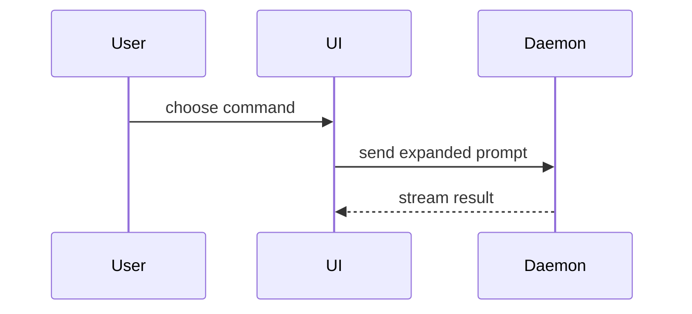

Use this template for the merge record of a topic branch. The merge record is the comment on the Gitea issue of the ticket when the branch is merged. The same text is the body of a Gitea pull request when one exists.

Post the record with the comment operation of `docs/agents/issue-tracker.md` (section "Generic operations"). When a pull request exists, set its body through the Gitea pull request API: `PATCH "$API/pulls/$INDEX"` with `body`. `$API` is the shell variable of the tracker document, and the token is the token of that document. `$INDEX` is the index of the pull request: the `number` field of its entry in the reply to `GET "$API/pulls?state=open"`.

```markdown
## Summary

<diagram, diff-sketch, or tree>

## Evidence

- **Before:** <screenshot/output/failing test run>
  **After:** <screenshot/output/passing test run>
- **unittest:** <last output line>
- **examples:** <last output line>
- **overlay:** <last output line>
- **publish set:** <last output line>
- **scan:** <result line>

**Not proved:**

- <item that no check or run proves, or "none">

## Merge Danger

**Door:** <one-way or two-way>

<optional: description>

**Blast Radius:** <one-word description>

<optional: potential ramifications of merge>

**Gate:** <release gate that the change triggers, or "none">

## slopscore

<left for the slopscore-pr skill>
```

## Sections

Skip all preambles and keep prose brief. Use the user's domain language from `GLOSSARY.md`.

### Summary

Pick the smallest view that makes the key point clear.

- Show logic or an algorithm as pseudocode:

```text
on(save)
  if content is unchanged
    return cached result
  write new content
  return fresh result
```

- Show runtime control flow as a call tree:

```text
submitForm
  createSession
    persistPrompt
    launchAgent
  navigateToSession
```

- Show UI structure as a component tree, including state and module boundaries that matter:

```text
<SessionPage> (apps/example/src/routes/session.tsx)
  useSessionEvents()
  <SessionToolbar>
    <RunSkillButton> (packages/ui)
```

- Show file responsibility or a broad refactor as a shallow file tree:

```text
src/
├── commands/       # parses user actions
├── sessions/       # owns session state
└── transport/      # sends API requests
```

- Show component interaction, control flow, or data flow with Mermaid. Gitea renders Mermaid in comments and in a pull request body:



- Use `diff` when the point is what changes and the surrounding shape already exists. Match the diff shape to the topic.

For a component change:

```diff
 <SessionPage>
   useSessionEvents()
   <SessionToolbar>
+    <RunSkillButton />
   <SessionTimeline>
+    <SkillResultCard />
```

For a file-layout change:

```diff
 src/
 ├── commands/
+│   └── show-me.ts       # expands the slash command
 ├── sessions/
-└── transport.ts
+└── transport/
+    ├── client.ts
+    └── stream.ts
```

For a call-tree or call-stack change:

```diff
 submitForm
   createSession
     persistPrompt
+    expandSkillMention
     launchAgent
-  navigateToSession
+  navigateToSession
+    subscribeToEvents
```

For a state or control-flow change:

```diff
 on(save)
-  write content
+  if content is unchanged
+    return cached result
+  write new content
+  invalidate cache
```

- Show the whole block when most of it is new, when omitted context would hide ownership or order, or when the user needs a copyable target shape:

```ts
function expandSkill(command: string): string {
  const skillName = command.slice(1);
  return `use the ${skillName} skill`;
}
```

#### Guidance

Place each visual next to the short text it supports. Keep only the calls, files, props, states, and boundaries needed to answer the user's current question or the options to resolve the current discussion point.

You may use one of these, you may use several, it is unlikely you will use all of them. Use your judgement and don't overwhelm the user.

### Evidence

Concrete evidence that the change works. Show a before and after.

Screenshots are S-tier - when the environment is set up for it and the change is visual. Take a screenshot only through `pidesktop`, which shows the page in the browser of the user of the installation. Never use a local browser. The `walkr` skill is the review loop of an HTML artifact, not a screenshot tool.

Execution-based evidence is A-tier. Test results, console output. Show the exact test that now fails and passes, using pseudocode.

The section is also the acceptance comment form of the ticket workflow. Run the four offline checks from the root of the repository and give the last output line of each:

```sh
PYTHONDONTWRITEBYTECODE=1 python3 -m unittest discover -s tests -q
PYTHONDONTWRITEBYTECODE=1 python3 scripts/examples.py
PYTHONDONTWRITEBYTECODE=1 python3 scripts/validate.py --overlay config/config.example.json
PYTHONDONTWRITEBYTECODE=1 python3 scripts/publish_check.py
```

Give the result line of the scan of the commits of the branch (`docs/secret-handling.md`):

```sh
scripts/scan.sh history <base>..HEAD
```

Copy each line as the command prints it. Never write "passed" for a check that did not run.

End the section with the "Not proved" list: each claim of the change that no check and no run proves. Write "none" only when each acceptance criterion has evidence.

### Merge Danger

Describe whether it's a one-way or two-way door. You can walk back through two-way doors, but not one-way doors. A merge that is cheap to roll back is lower risk. Changes that involve destructive actions or hard-to-reverse decisions are one-way doors.

The blast radius is the potential impact or scope of the changes introduced by this merge. Consider all possibilities. Examples are layout shift, breakages for consumers, mobile responsiveness, etc.

Say which release gate the change triggers. The release checklist `docs/guides/release-checklist.md` is the gate list. `docs/publishing.md` and `docs/secret-handling.md` describe the two commands of the table. A dangerous change is one that can reach a portable snapshot: a published copy has no rollback.

| Change | Gate that it triggers |
| --- | --- |
| A new or changed text of the publish set | The public reader check: `PYTHONDONTWRITEBYTECODE=1 python3 scripts/publish_check.py --public` |
| A commit that can hold a secret or a host value, or a change of a deny list, an allow list or a scan rule | The scan at level `fail` on the history: `scripts/scan.sh --level fail history <base>..HEAD` |

For a change of the publish set itself, of a check, of the manifest or of the install path, name each gate of the release checklist that the change can fail. Name each gate that applies, or write "none". The merge record names the gate. It does not say that the gate passed, unless the Evidence section holds its output line.

### slopscore

The merge record names the `## slopscore` section and leaves it empty. Do not fill it by hand. Load the slopscore-pr skill: the Skill tool in Claude Code, a read of its SKILL.md in Pi. That skill fills the section of a pull request. For a merge-record comment without a pull request, put the block that the skill prints under the heading.
